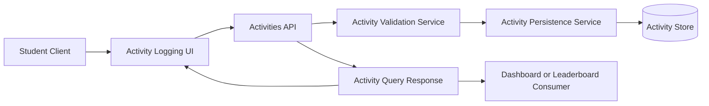

# Architecture for OCTOFIT-4

## Title
Student Activity Logging Architecture

## Source
- Requirements document: artifact/requirements.md
- Jira issue: OCTOFIT-4

## Architecture Summary
The recommended architecture extends the existing Express scaffold with a dedicated activity logging flow. A lightweight client collects activity data, the API validates and persists it through an activity service, and the same service exposes stored activities for downstream dashboard or leaderboard consumers.

## Assumptions
- Activity logging is performed through the existing web client served by the current backend scaffold.
- The initial persistence layer can remain in-memory for this repository because no external data store has been provisioned in the workspace.
- The story requires downstream data availability, but it does not require implementing a full dashboard or leaderboard UI in this repository.
- Authentication context is outside current scope, so the scaffold will model student ownership using explicit activity payload fields rather than session-derived identity.

## Recommended Architecture
Adopt a layered activity logging flow with four primary boundaries:
1. Presentation layer for activity submission and recent activity display.
2. API layer for request intake, response shaping, and downstream retrieval.
3. Activity domain service for validation, sanitization, persistence, and retrieval.
4. Persistence boundary for storing activity records in the configured data store.

## Key Components And Responsibilities
- Activity Logging UI: Collects activity data, submits it to `/api/activities/`, and shows success or validation feedback.
- Activities API: Accepts create and read requests, coordinates service calls, and returns consistent JSON responses.
- Activity Validation Service: Validates, sanitizes, and normalizes activity fields before persistence.
- Activity Persistence Service: Stores valid activity records and returns persisted or queryable activity data.
- Activity Store: Holds the logged activities for downstream consumers.
- Downstream Consumer Contract: Reads persisted activity data through the API rather than from frontend-local state.

## Data Flow
1. A student enters activity details in the client interface.
2. The activity UI submits the payload to `/api/activities/`.
3. The API forwards the payload to the activity validation and persistence service.
4. The service sanitizes and validates the submitted data.
5. If validation fails, the API returns clear field-level feedback.
6. If validation succeeds, the service persists the activity record.
7. The API returns a success response containing the stored activity summary.
8. A downstream dashboard or leaderboard consumer can read logged activities through the activity query interface.

## Technology Choices
- Client layer: Existing static frontend served from the current Express application.
- API layer: Existing Express backend extended with `/api/activities/` routes.
- Domain logic: Service-layer JavaScript module for validation, persistence, and retrieval.
- Persistence: In-memory repository consistent with the current scaffold constraints.
- Security controls: Input sanitization, bounded field validation, and controlled error payloads.

## Risks And Tradeoffs
- In-memory persistence is sufficient for this workspace demonstration, but it does not satisfy production durability needs.
- The activity schema is minimally defined by the story, so field choices may need revision when dashboard requirements are clarified.
- Without a real authentication context, student ownership is modeled in a simplified way.
- A single endpoint for downstream access is pragmatic for this scope, but future consumers may require filtering, aggregation, or pagination.

## Open Questions
1. Which activity fields are required by product design and analytics consumers?
2. Does downstream consumption require filtering, aggregation, or sorting beyond simple retrieval?
3. What long-term persistence technology should replace the scaffold's in-memory store?
4. Should activity entries support updates or deletions after creation?