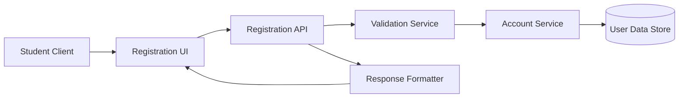

# Architecture for OCTOFIT-3

## Title
Student Registration Architecture

## Source
- Requirements document: artifact/requirements.md
- Jira issue: OCTOFIT-3

## Architecture Summary
The recommended architecture is a standard web application registration flow built around a client-facing registration interface, an application API layer, validation and account creation services, and a persistence layer. The design prioritizes simple user onboarding, secure input handling, and clear success or validation responses.

## Assumptions
- Registration is performed through an existing web or app client that calls the backend API.
- The exact registration fields are application-defined and may evolve independently of the high-level architecture.
- Authentication and authorization capabilities already exist or will be provided by the broader platform.
- The initial scope is limited to registration and immediate account creation behavior.

## Recommended Architecture
Adopt a layered architecture with four primary boundaries:
1. Presentation layer for registration UI and response handling.
2. API layer for request intake and response shaping.
3. Registration domain services for validation and account creation logic.
4. Persistence and security support services for storing account data and protecting sensitive fields.

## Key Components And Responsibilities
- Registration UI: Collects student registration input, submits it to the backend, and displays success or validation feedback.
- Registration API: Accepts registration requests at `/api/users/register/`, coordinates processing, and returns consistent responses.
- Validation Service: Validates, sanitizes, and normalizes incoming registration data before account creation.
- Account Service: Creates the student account and applies post-registration behavior determined by the platform.
- User Data Store: Persists student account data and supports retrieval for subsequent platform access.
- Security Support: Protects sensitive data handling, error exposure, and request processing safeguards.

## Data Flow
1. A student enters registration information in the client interface.
2. The registration UI sends the request to `/api/users/register/`.
3. The API forwards the payload to the validation service.
4. The validation service sanitizes and validates the submitted data.
5. If validation fails, the API returns clear validation feedback to the client.
6. If validation succeeds, the account service creates the student account in the user data store.
7. The API triggers the configured post-registration outcome and returns a success response.
8. The client displays the resulting success or error state to the student.

## Technology Choices
- Client layer: Web SPA or comparable client already used by the platform.
- API layer: Existing application backend exposing `/api/users/register/`.
- Domain logic: Service-layer implementation for validation and account creation.
- Persistence: Existing platform user store or user repository.
- Security controls: Input sanitization, transport security, and protected storage for sensitive fields.

## Risks And Tradeoffs
- The exact registration model is still undefined, so the validation and data schema boundaries may change.
- The post-registration behavior is not fixed, which may affect session handling and UX flow.
- Missing policy details around password, identity, consent, and privacy could require architecture updates.
- A simple layered approach is pragmatic for current scope, but broader identity workflows may later justify a dedicated identity service.

## Open Questions
1. Which fields are mandatory for registration, and which are optional?
2. What is the required post-registration behavior?
3. Are there compliance or privacy rules that require additional controls or auditability?
4. Are there scale or performance targets that would change the chosen architecture?