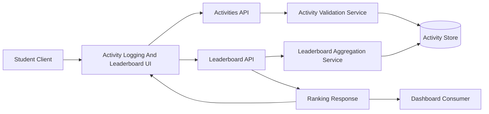

# Architecture for OCTOFIT-5

## Title
Student Leaderboard Rankings Architecture

## Source
- Requirements document: artifact/requirements.md
- Jira issue: OCTOFIT-5

## Architecture Summary
The recommended architecture extends the existing Express scaffold with a leaderboard query flow built on top of the existing activity logging store. The backend aggregates tracked activities into ranked student entries, exposes the results through `/api/leaderboard/`, and the client renders the returned rankings alongside the existing activity experience.

## Assumptions
- Activity logging is already available through the existing web client served by the current backend scaffold.
- The initial persistence layer can remain in-memory for this repository because no external data store has been provisioned in the workspace.
- The leaderboard story requires both an API response and an in-repo display surface, but it does not require advanced analytics, filters, or pagination.
- Authentication context is outside current scope, so rankings continue to use the explicit student name already present on tracked activities.

## Recommended Architecture
Adopt a layered leaderboard flow with four primary boundaries:
1. Presentation layer for leaderboard display and activity-triggered refresh.
2. API layer for leaderboard request handling and response shaping.
3. Activity domain service for activity retrieval and leaderboard aggregation.
4. Persistence boundary for the tracked activity records used as leaderboard source data.

## Key Components And Responsibilities
- Activity Logging And Leaderboard UI: Submits activity data, fetches leaderboard results, and renders ranked student entries.
- Activities API: Continues to accept create and read requests for tracked activities.
- Leaderboard API: Returns ranked student data through `/api/leaderboard/`.
- Leaderboard Aggregation Service: Derives ranking entries from tracked activity records and applies deterministic ordering.
- Activity Store: Holds the logged activities that act as the leaderboard source of truth.
- Downstream Consumer Contract: Reads leaderboard data through the API rather than reconstructing rankings from frontend-local state.

## Data Flow
1. A student logs activities through the existing activity interface.
2. The activities API validates and persists tracked activity data in the in-memory store.
3. The client requests `/api/leaderboard/`.
4. The leaderboard API asks the activity service for ranked leaderboard entries.
5. The aggregation logic groups activity records by student and computes ranking totals.
6. The API returns a consistent leaderboard response containing rank and summary fields suitable for display.
7. The client renders the leaderboard and refreshes it after successful activity submissions.

## Technology Choices
- Client layer: Existing static frontend served from the current Express application, extended with leaderboard rendering.
- API layer: Existing Express backend extended with `/api/leaderboard/`.
- Domain logic: Existing activity service extended with leaderboard aggregation derived from tracked activities.
- Persistence: In-memory repository consistent with the current scaffold constraints.
- Security controls: Existing input sanitization and controlled read responses limited to leaderboard display data.

## Risks And Tradeoffs
- In-memory persistence is sufficient for this workspace demonstration, but it does not satisfy production durability needs.
- The story does not define the exact ranking formula, so the scaffold must choose a simple aggregation that may need revision later.
- Without a real authentication context, rankings are keyed by submitted student names and not verified user identities.
- A single summary leaderboard endpoint is pragmatic for this scope, but future consumers may require time windows, pagination, or richer statistics.

## Open Questions
1. Should rank be determined by duration only, by activity count, or by a future points model?
2. Does downstream consumption require filters such as date ranges or cohort-specific views?
3. What long-term persistence technology should replace the scaffold's in-memory store?
4. Should the leaderboard expose additional fields such as badges, streaks, or trend indicators?