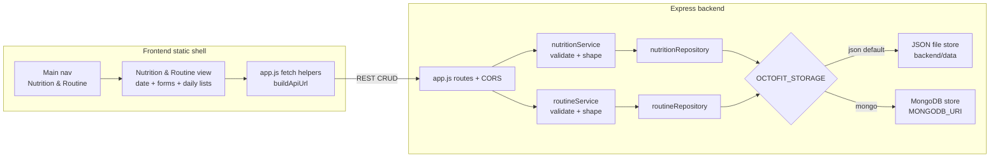

# Architecture — OCTOFITAI-15

## Title

Nutrition & Daily Routine Tracker (MVP) — Architecture From Requirements

## Source

- Requirements: `artifacts/OCTOFITAI-15/requirements.md`
- Jira: [OCTOFITAI-15](https://laxmanchavan2080.atlassian.net/browse/OCTOFITAI-15)
- Repo patterns reviewed: Express routes in `backend/src/app.js`; service + validation style in `activityService` / `registrationService` / `teamService`; repository boundary in `teamRepository`; static UI + `buildApiUrl`/`fetch` in `frontend/app.js` and section layout in `frontend/index.html`

## Architecture Summary

Extend the existing OctoFit Express + static-frontend scaffold with two new REST resources—**Nutrition** and **Routine**—backed by a shared persistence abstraction that defaults to a JSON file store and switches to MongoDB when configured. The frontend adds a main-nav item and a dedicated Nutrition & Routine view (date picker, create/edit forms, daily lists) that calls the new APIs with the same `fetch` + field-error patterns used by activity logging. No new SPA framework, auth system, or nested “daily tracker” aggregate resource is introduced; the design stays additive and consistent with `/api/activities/` and `/api/teams/` conventions.

## Assumptions

- Existing registration, activity, team, and bootstrap surfaces remain unchanged except for shared CORS method allow-list updates needed for update/delete verbs.
- MVP identity is an explicit `userId` on create/list (and retained on stored records), aligned with registration account `id` when present; no session/JWT middleware is required.
- Multiple Nutrition entries per user/date are allowed; multiple Routine entries per user/date are also allowed (CRUD symmetry; daily view lists all).
- Water intake is stored as a non-negative number; unit label “ml” is UI-only.
- Sleep hours validated 0–24 inclusive; steps non-negative integers; optional nutrition macros/calories non-negative when provided.
- Playwright smoke will be introduced for this story (none exists in the repo today); it targets the new nav + forms + daily lists for today’s date.
- Current in-memory activity/team/registration stores are out of scope for migration; only Nutrition and Routine use the new JSON/Mongo persistence path for this MVP.

## Recommended Architecture

### Style

**Modular monolith / layered Express API** plus **static multi-view frontend**:

1. **HTTP layer** (`app.js`): route wiring, CORS, JSON body parsing, status code mapping.
2. **Domain services** (`nutritionService`, `routineService`): validation, sanitization, response shaping (`status: success|error`, field-level `errors`).
3. **Persistence ports** (`nutritionRepository`, `routineRepository` or a shared store adapter): create/read/update/delete/list-by-filters, swappable JSON vs Mongo implementation behind one contract.
4. **Frontend view layer**: add a lightweight view switcher (nav + show/hide dedicated section) in the existing static `index.html` / `app.js` shell; no client router library.

### REST resource shape (resolved)

Follow existing trailing-slash resource paths; keep Nutrition and Routine as **sibling resources** (not nested under a parent daily-tracker):

| Method | Path | Purpose |
|--------|------|---------|
| `POST` | `/api/nutrition/` | Create nutrition entry |
| `GET` | `/api/nutrition/?userId=&date=` | List by user + date (`userId` + `date` required) |
| `GET` | `/api/nutrition/:id` | Read one (optional; edit may use list-row payload) |
| `PUT` | `/api/nutrition/:id` | Full update |
| `DELETE` | `/api/nutrition/:id` | Delete → `204` |
| `POST` | `/api/routine/` | Create routine entry |
| `GET` | `/api/routine/?userId=&date=` | List by user + date (`userId` + `date` required) |
| `GET` | `/api/routine/:id` | Read one (optional; edit may use list-row payload) |
| `PUT` | `/api/routine/:id` | Full update |
| `DELETE` | `/api/routine/:id` | Delete → `204` |

Response conventions match existing APIs:

- Success create: `201` + `{ status: 'success', nutrition|routine: { ... } }`
- Success list/update: `200` + `{ status: 'success', ... }`
- Success delete: **`204` No Content** (no body) for both resources
- Validation failure: `400` + `{ status: 'error', errors: { field: ['message'] } }`
- List without required `userId` and/or `date` query params: **`400`** with field errors
- Missing resource: `404` + `{ status: 'error', message: '...' }` (or field-style errors consistent with team join)

CORS in `app.js` must allow `PUT` and `DELETE` in addition to current `GET,POST,OPTIONS`.

### Persistence switch (resolved)

Introduce an env-driven store selection used only by Nutrition/Routine repositories:

| Variable | Values | Behavior |
|----------|--------|----------|
| `OCTOFIT_STORAGE` | unset / `json` (default) | Persist to a JSON file under `backend/data/` (e.g. `nutrition.json`, `routine.json`) |
| `OCTOFIT_STORAGE` | `mongo` | Use MongoDB collections `nutrition` and `routine` |
| `MONGODB_URI` | connection string | Required when `OCTOFIT_STORAGE=mongo` |

Public REST contract is identical for both stores. Tests should force `json` (or an injectable in-memory/file path) for isolation; reset helpers analogous to `resetActivities` / `resetTeams` remain for unit tests.

### User identity (resolved)

- Required field on create: `userId` (string or number coerced to a stable string key; prefer numeric registration `id` when UI has a registered student).
- List filters: query params `userId` and `date` (`YYYY-MM-DD`), both required for list-by-date/user acceptance criteria.
- No auth middleware in MVP; trust explicit `userId` as today’s activity flow trusts `studentName`.

### Routine cardinality (resolved)

Allow **unlimited Routine entries per user per date** (same as Nutrition). Avoid upsert/unique constraints for MVP so create/edit/delete and “list all for selected date” stay simple and testable.

### Frontend impact (explicit)

1. **Main navigation** — Add a visible nav control labeled **Nutrition & Routine** in the page shell (new top-of-shell nav; today the UI has no nav, only stacked sections). Selecting it reveals the dedicated view and hides or de-emphasizes the bootstrap/activity primary surface so the feature is discoverable without deep links.
2. **Dedicated page/view** — New primary section (e.g. `#nutrition-routine-view`) containing:
   - Date control (default today)
   - Nutrition form (meal type select: Breakfast/Lunch/Dinner/Snack, description, optional calories/macros)
   - Routine form (sleep hours, water intake, steps)
   - Daily lists for Nutrition and Routine with per-row Edit/Delete (MVP “daily summary” = these lists; calorie/step totals are optional enhancement only)
3. **API client calls** — Extend `frontend/app.js` with `buildApiUrl`-based `fetch` helpers for:
   - `GET /api/nutrition/?userId=&date=`
   - `POST/PUT/DELETE /api/nutrition/...`
   - `GET /api/routine/?userId=&date=`
   - `POST/PUT/DELETE /api/routine/...`
   - Reload lists after successful create/update/delete; load on date/`userId` change and on view open so refresh-safe persistence is visible.
4. **Validation / status UX** — Reuse field-error patterns from activity submit; ensure status feedback remains visible when the Nutrition view is active (global `#status` may be hidden with the bootstrap surface—use view-local status if needed). Surface API `errors` and non-OK responses without silent failure.
5. **Playwright surface** — Stable selectors/ids on nav, date input, both forms, and daily list items so smoke can create one Nutrition + one Routine for today and assert visibility. Prefer repo-root Playwright config + `e2e/` (or `tests/e2e/`) separate from backend `node --test`.
6. **`userId` in UI** — MVP control: simple numeric/text input or select seeded from bootstrap users list when available; required for list/create calls.

Out of scope in FE: food DB/search UI, barcode, recommendations, social sharing.

## Component Diagram

## Key Components And Responsibilities

| Component | Responsibility |
|-----------|----------------|
| `app.js` | Register Nutrition/Routine routes; expand CORS methods; map service results to HTTP status/body |
| `nutritionService` | Sanitize/validate meal type, description, optional calories/macros; enforce `userId` + `date`; CRUD orchestration |
| `routineService` | Sanitize/validate sleepHours, waterIntake, steps; enforce `userId` + `date`; CRUD orchestration |
| `nutritionRepository` / `routineRepository` | Persistence port: create, getById, update, delete, listByUserAndDate; id allocation |
| JSON store adapter | Read/write durable JSON files; survive process restart |
| Mongo store adapter | Same repository contract against Mongo collections when `OCTOFIT_STORAGE=mongo` |
| Frontend nav + view | Discoverability (FR-01), date-driven daily UX (FR-02–FR-04), forms and lists (FR-05–FR-19) |
| Backend tests | Create valid, reject invalid, update, delete, list by date/user for both resources (FR-28) |
| Playwright smoke | Nav → create Nutrition + Routine for today → assert daily view (FR-29) |

### Suggested resource fields

**Nutrition:** `id`, `userId`, `date`, `mealType`, `description`, optional `calories`, `protein`, `carbs`, `fat`, `createdAt`, `updatedAt`

**Routine:** `id`, `userId`, `date`, `sleepHours`, `waterIntake`, `steps`, `createdAt`, `updatedAt`

## Data Flow

### Create (Nutrition or Routine)

1. User opens Nutrition & Routine view, selects date (default today), supplies `userId` and form fields.
2. Client runs basic validation; on pass, `POST` JSON to `/api/nutrition/` or `/api/routine/`.
3. Service validates authoritatively; on failure returns `400` + field errors (nothing persisted).
4. Repository assigns `id`, writes via active store, returns record.
5. Client shows success status, clears/resets form as appropriate, reloads daily lists for `userId` + date.

### List / refresh

1. On view open, date change, or after mutation, client `GET`s both list endpoints with `userId` and `date`.
2. UI renders Nutrition list and Routine list; edit/delete actions bind to row `id`.

### Update / delete

1. Edit loads row into form (or inline editors); `PUT` with full validated payload.
2. Delete confirms (or clear destructive control), then `DELETE` by `id`.
3. Missing `id` → `404`; client surfaces error; successful paths refresh lists so reload remains consistent with store.

### Persistence backends

- **JSON:** repository serializes collections to disk after each successful write (or batched write of full collection); reads hydrate on process start / first access.
- **Mongo:** repository maps the same document shape to collections; filters `{ userId, date }` for list.

## Technology Choices

| Choice | Decision | Rationale |
|--------|----------|-----------|
| API framework | Existing Express (`backend/`) | Match scaffold; avoid new stack |
| Validation | Service-layer field errors (activity/team style) | Consistent FE error display |
| Persistence | JSON file default; Mongo via `OCTOFIT_STORAGE` + `MONGODB_URI` | Story requirement; no prior Mongo switch in repo — establish this convention |
| Identity | Explicit `userId` on payloads/queries | Aligns with registration `id` / team `accountId`; no full auth in scaffold |
| REST shape | Separate `/api/nutrition/` and `/api/routine/` | Mirrors `/api/activities/` and `/api/teams/`; simpler than aggregate parent resource |
| Update verb | `PUT` | Full-record replace; sufficient for MVP forms |
| Frontend | Static HTML/JS section + nav switcher | Matches current `frontend/`; no React/router dependency |
| BE tests | Node test runner + supertest (existing) | Extend `backend/test/` |
| E2E | Playwright smoke (new) | Required by FR-29; not present yet |
| Mongo driver | Add only when implementing Mongo path (e.g. official `mongodb` package) | Keep default path dependency-free |

## Risks And Tradeoffs

| Risk / tradeoff | Impact | Mitigation |
|-----------------|--------|------------|
| JSON file concurrency | Concurrent writes can race in multi-process deploys | Acceptable for MVP scaffold; single Node process assumed; document limitation |
| Dual store complexity | Two implementations to keep in sync | Shared repository interface + identical integration tests against JSON; Mongo path covered by focused adapter tests or optional suite when URI present |
| No real auth | Clients can spoof `userId` | Accepted for scaffold; same class of risk as free-text `studentName` on activities |
| Multiple routines per day | Users may log duplicate wellness rows | Prefer simplicity for CRUD AC; product can later add unique(userId,date) + upsert |
| First PUT/DELETE in app | CORS and FE helpers must expand beyond POST | Explicit CORS update + shared fetch helper for mutating verbs |
| Frontend nav is new UX surface | Easy to clutter the single-page shell | Keep one nav + one dedicated view; do not rebuild dashboard as SPA |
| Playwright greenfield | Extra setup (config, scripts, selectors) | Minimal smoke only; stable ids on critical controls |
| Leaving activities/teams in-memory | Operational inconsistency across features | Scoped intentionally to this story; do not broaden persistence rewrite |

## Open Questions

Resolved (including design review):

1. **Routine cardinality** → Allow multiple routine entries per user/date.
2. **REST path shape** → Sibling resources `/api/nutrition/` and `/api/routine/` with query filters; no parent daily-tracker resource.
3. **Mongo config switch** → `OCTOFIT_STORAGE=json|mongo` (default `json`) and `MONGODB_URI` when mongo.
4. **User identity** → Explicit `userId` on create/list (registration account id when available).
5. **Delete response** → `204` No Content for both resources.
6. **GET by id** → Optional; edit UX may use list-row payload already in memory.
7. **Daily summary** → MVP lists only; aggregate totals optional enhancement.
8. **List filters** → `userId` and `date` required; missing → `400`.
9. **Playwright layout** → Prefer repository root (`playwright.config` + `e2e/` or `tests/e2e/`); exact npm script name deferred to impl plan.

Remaining non-blocking (implementation planning):

1. Exact Playwright npm script name.
2. Whether `backend/data/*.json` is gitignored vs empty committed seeds (prefer create-on-write + gitignore).
3. Static HTML forms vs JS-built forms—either acceptable if Playwright selectors stay stable.

