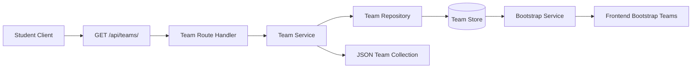

# Architecture for OCTOFIT-8

## Title
Available Team Listing Architecture

## Source
- Requirements document: artifacts/requirements.md
- Jira issue: OCTOFIT-8

## Architecture Summary
The recommended architecture adds a dedicated read path for available teams through `GET /api/teams/`, backed by the existing team domain modules in the Node.js and Express backend. The design keeps HTTP routing, list orchestration, and repository access separated so the frontend can consume a stable team collection from both the new endpoint and any existing bootstrap payload that already exposes team data.

## Assumptions
- The existing Express backend in this workspace remains the system boundary for this story.
- The workspace already contains a frontend that displays team data, so backend response shape compatibility with that client matters even if no new frontend workflow is introduced.
- The story requires retrieval only; it does not add team creation, mutation, pagination, filtering, or authentication requirements.
- The current project storage model is sufficient for this story as long as `GET /api/teams/` returns the available team records from the application's team data source.

## Recommended Architecture
Use a small layered read architecture inside the existing team domain:
1. An API layer exposes `GET /api/teams/` as the canonical available-team listing endpoint.
2. A team service layer owns the list use case and response shaping for client consumption.
3. A team repository or store boundary remains the single source of truth for team records.
4. Existing frontend consumers continue to render team data from the shared backend contract, either via the listing endpoint directly or via bootstrap data sourced from the same repository.

## Key Components And Responsibilities
- Team Listing API: Accepts `GET /api/teams/` requests, owns HTTP status and JSON response handling, and delegates team retrieval work.
- Team Service: Centralizes available-team retrieval and any response normalization needed so API and frontend-facing consumers see a consistent team shape.
- Team Repository Or Store: Provides the underlying available team records and stays responsible for data access rather than route handlers or frontend code.
- Bootstrap Service: If the frontend already depends on bootstrap team data, it should source teams from the same repository-backed flow or a contract-compatible shape.
- Frontend Consumer: Displays available teams for selection using the backend-provided team collection without hard-coded assumptions beyond the agreed contract.

## Data Flow
1. A student client requests `GET /api/teams/`.
2. The team listing route delegates the request to the team service.
3. The team service retrieves team records through the shared team repository or store.
4. The service returns an API-ready team collection in a frontend-consumable JSON structure.
5. The API returns the available teams in the standard backend response envelope.
6. When bootstrap data includes teams, that payload should remain aligned with the same repository-backed team shape so the frontend does not observe divergent contracts.

## Technology Choices
- API framework: Existing Express application in the backend.
- Domain structure: Existing team service and repository modules extended or refined for the list use case.
- Persistence boundary: Existing team repository or store abstraction as the source of truth for available teams.
- Data format: JSON response contract aligned with the current backend envelope and frontend consumption needs.
- Frontend surface: Existing static frontend JavaScript that consumes bootstrap or API team data.

## Risks And Tradeoffs
- The requirements do not define the exact team fields needed for display, so the implementation must keep the returned team shape compatible with current frontend expectations or adjust the frontend explicitly.
- If bootstrap and `GET /api/teams/` diverge in shape or source, the frontend can render inconsistent team information across load paths.
- If the repository returns internal-only fields directly, the endpoint could expose unstable data that makes future frontend changes harder.
- Process-lifetime storage may be acceptable for this story, but the endpoint still needs to reflect the application's current available team records rather than a separate hard-coded list.

## Open Questions
1. What exact team fields does the current frontend render for selection and display?
2. Should `GET /api/teams/` return the raw repository records or a narrowed client-facing projection?
3. Does the current bootstrap payload already expose the same team shape expected from the new endpoint, or is a compatibility adjustment required?