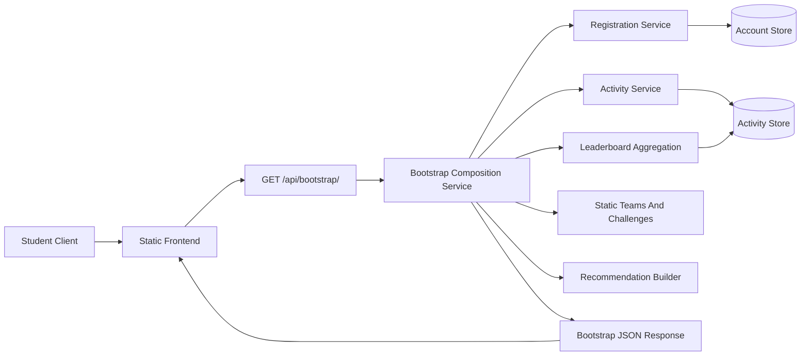

# Architecture for OCTOFIT-6

## Title
Application Bootstrap Data Architecture

## Source
- Requirements document: artifacts/requirements.md
- Jira issue: OCTOFIT-6

## Architecture Summary
The recommended architecture adds a bootstrap aggregation flow to the existing Express application so the frontend can fetch the core OctoFit entry experience in a single request. The backend composes hero content, dashboard metrics, users, teams, activities, challenges, leaderboard data, and recommendations into one `/api/bootstrap/` response, and the static frontend loads that response from a configurable API base URL.

## Assumptions
- The current repository keeps the existing Express backend and static frontend as the approved implementation surfaces.
- Activity and registration data continue to be stored in-memory for this scaffold stage.
- Teams, challenges, and recommendations can be generated by a dedicated bootstrap composition service until richer source systems exist.
- The existing activity and registration routes remain valid and continue to be used for mutations.

## Recommended Architecture
Adopt a layered bootstrap flow with five primary boundaries:
1. Presentation layer for initial page rendering from a single bootstrap response.
2. API layer for bootstrap route handling and JSON response delivery.
3. Bootstrap composition service that assembles entry-view sections.
4. Existing domain services for activities, registrations, and leaderboard derivation.
5. In-memory stores that continue to hold current scaffold data.

## Key Components And Responsibilities
- Static Frontend: Loads bootstrap data on entry, renders hero, dashboard, recent activity, leaderboard, and recommendations, and uses the configured API base URL.
- Bootstrap API: Exposes `/api/bootstrap/` and returns the full entry response contract.
- Bootstrap Composition Service: Assembles all bootstrap sections into one stable JSON payload.
- Registration Service: Supplies current user account data for the bootstrap payload.
- Activity Service: Supplies recent activities and leaderboard-derived metrics for the bootstrap payload.
- Recommendation Builder: Produces lightweight student-facing recommendations based on available data.
- Static Content Providers: Supply scaffold teams and challenges until persistent domain models exist.

## Data Flow
1. The frontend loads and resolves the configured API base URL.
2. On entry, the client requests `GET /api/bootstrap/`.
3. The bootstrap route delegates response assembly to the bootstrap composition service.
4. The composition service reads user data from the registration service.
5. The composition service reads activity and leaderboard data from the activity domain service.
6. The composition service adds scaffold teams, challenges, hero content, dashboard metrics, and recommendations.
7. The API returns one JSON response containing all required entry sections.
8. The frontend renders the returned sections and refreshes them again after successful activity submissions.

## Technology Choices
- Client layer: Existing static HTML, CSS, and browser JavaScript with a configurable API base URL.
- API layer: Existing Express backend extended with `/api/bootstrap/`.
- Domain logic: A dedicated bootstrap service that composes data from existing activity and registration services.
- Persistence: Existing in-memory stores for scaffold data.
- Security controls: Existing request validation for mutations and controlled read responses for bootstrap consumption.

## Risks And Tradeoffs
- In-memory persistence remains sufficient for the scaffold, but it does not preserve bootstrap-backed data across restarts.
- Some bootstrap sections are currently scaffolded rather than backed by dedicated persistent models.
- A single bootstrap response simplifies entry rendering, but larger payloads may need segmentation or caching if scope grows.
- The frontend still depends on a static document shell, so richer state management is deferred.

## Open Questions
1. Should teams and challenges become first-class persisted domain models in a later story?
2. Does the product require per-user personalization rules for recommendations beyond simple scaffold heuristics?
3. Should the bootstrap response eventually include cache metadata or versioning?
4. What long-term API base URL configuration mechanism should be preferred across environments?