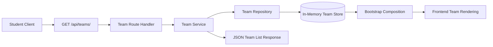

# Architecture for OCTOFIT-8

## Title
Available Team Listing Architecture

## Source
- Requirements document: artifacts/requirements.md
- Jira issue: OCTOFIT-8

## Architecture Summary
OCTOFIT-8 should reuse the existing team-management slice in the Express backend and expose `GET /api/teams/` as the canonical team-listing interface for clients. The route should delegate to the existing team service and shared team repository so the list response, bootstrap payload, and any prior team-creation flow all read from one team source of truth.

## Assumptions
- The current Express backend remains the system boundary for the story.
- No new frontend feature is required beyond validating that the existing client can consume the team-listing shape.
- The current team record shape of `id`, `name`, `memberCount`, and `focus` is sufficient to satisfy the story's display requirement.
- In-memory persistence remains acceptable for this story because the Jira acceptance criteria require team retrieval for display but do not introduce a new durability requirement.

## Recommended Architecture
Use the existing layered team stack and keep the listing flow thin:
1. An API route at `GET /api/teams/` handles HTTP concerns and returns the JSON envelope.
2. A team service layer provides the API-ready team list and shields route handlers from persistence details.
3. A shared team repository remains the single source of truth for team records.
4. The bootstrap payload reuses the same team service output so the frontend sees one consistent team shape.

## Key Components And Responsibilities
- Team Listing API: Exposes `GET /api/teams/`, owns HTTP status codes and JSON serialization, and returns a `status` plus `teams` response envelope.
- Team Service: Maps repository records into the client-consumable team shape used by the listing endpoint and bootstrap payload.
- Team Repository: Stores and returns team records for both the listing route and any upstream creation flow.
- Bootstrap Service: Reuses the same team service output to keep the frontend bootstrap response aligned with the canonical listing contract.
- Frontend Consumer: Iterates over the `teams` array and renders team name, member count, and focus details without requiring per-story transformation logic.

## Data Flow
1. A client requests `GET /api/teams/`.
2. The route handler delegates to the team service.
3. The team service reads team records from the shared repository and maps them into the public team shape.
4. The route returns a success envelope containing the `teams` array.
5. The bootstrap flow reads the same team service output so the frontend-rendered team data stays consistent with the direct listing endpoint.

## Technology Choices
- API framework: Existing Express application in the backend.
- Domain structure: Existing CommonJS team service and repository modules.
- Persistence boundary: Existing in-memory team repository reused without introducing new storage infrastructure.
- Data contract: JSON response envelope with top-level `status` and `teams` fields.
- Frontend compatibility path: Existing static frontend bootstrap renderer used as the compatibility reference for the team record shape.

## Risks And Tradeoffs
- The Jira story references a React frontend, but the repository currently contains a static JavaScript frontend. Reusing a framework-agnostic JSON shape is the lowest-risk way to satisfy the client-consumability requirement without inventing a framework migration.
- In-memory team storage remains process-lifetime only, so the endpoint does not provide durability across restarts.
- The story focuses on listing only, so richer team metadata or pagination should remain out of scope unless a later story requires them.

## Open Questions
1. Should a later story require direct frontend fetches from `GET /api/teams/` instead of consuming the bootstrap payload?
2. Is process-lifetime in-memory storage still acceptable when a future team-join flow is introduced?