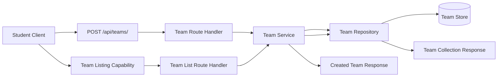

# Architecture for OCTOFIT-7

## Title
Fitness Team Creation And Listing Architecture

## Source
- Requirements document: artifacts/requirements.md
- Jira issue: OCTOFIT-7

## Architecture Summary
The recommended architecture adds a dedicated team domain flow to the existing OctoFit backend so students can create teams through `POST /api/teams/`, persist those teams through a single team repository boundary, and retrieve newly created teams through `GET /api/teams/`. The design keeps route handling, team business logic, and team persistence separated so creation and listing stay consistent and maintainable.

## Assumptions
- The existing Express backend in this workspace remains the system boundary for the story.
- The story requires backend support for team creation and team listing but does not require a new frontend workflow.
- The canonical team listing route for this story will be `GET /api/teams/` so creation and listing share one resource-oriented API surface.
- The requirements do not mandate a persistent database, so the persistence mechanism may reuse the project's current storage approach as long as created teams remain available after a successful create request completes and can be returned by the listing capability.

## Recommended Architecture
Use a small layered team-management architecture inside the existing backend:
1. An API layer exposes `POST /api/teams/` for creation and `GET /api/teams/` for reads.
2. A team service layer owns request validation orchestration, team creation rules, and response shaping for create and list operations.
3. A shared team repository or store boundary persists team records and serves both create and list flows from the same source of truth.
4. Existing frontend or API consumers call the listing capability to observe newly created teams.

## Key Components And Responsibilities
- Team Creation API: Accepts `POST /api/teams/` requests, parses JSON payloads, and delegates creation work without embedding persistence logic.
- Team Listing API: Exposes `GET /api/teams/` and returns persisted teams from the same underlying store used by creation.
- Team Service: Centralizes team creation and retrieval behavior, including any validation, normalization, identifier assignment, and mapping between internal team records and API responses.
- Team Repository Or Store: Persists team records and acts as the single source of truth for both successful creates and subsequent list reads.
- Client Consumer: Calls the create endpoint to submit a new team and calls the listing capability to display created teams.

## API Contract Decisions
- Create route: `POST /api/teams/` remains the required write endpoint.
- List route: `GET /api/teams/` is the canonical read endpoint for this story.
- Response style: Both routes should follow the backend's existing JSON envelope pattern, with a top-level `status` field and a domain payload field such as `team` for create and `teams` for list.
- Ownership: Route handlers own HTTP concerns, the team service owns validation and record creation, and the repository owns storage and retrieval.

## Data Flow
1. A student client sends a valid JSON request to `POST /api/teams/`.
2. The team creation route validates request shape at the API boundary and forwards the request to the team service.
3. The team service applies team creation rules, constructs a new team record, and writes it through the shared repository or store.
4. Persistence completes before the API reports success.
5. The API returns a success response for the created team.
6. A client requests `GET /api/teams/`.
7. The listing route reads teams through the same team service and repository path.
8. The listing response includes the previously created team because both flows depend on the same persisted team source.

## Technology Choices
- API framework: Existing Express application in the backend.
- Domain structure: A dedicated team service module behind route handlers.
- Persistence boundary: A team repository or store abstraction shared by create and list operations.
- Data format: JSON request and response contracts aligned with the existing backend API style.
- Initial storage approach: Reuse the repository's current persistence pattern unless a stronger persistence requirement emerges.

## Risks And Tradeoffs
- If team persistence remains in-memory, newly created teams may only be durable for the life of the running process; that is acceptable only if it still matches the project's current stage and expectations.
- The source story does not specify team fields, so the implementation still needs a minimal creation schema and list item shape that fit current application conventions.
- Keeping create and list flows on one shared repository boundary improves consistency, but it requires discipline to avoid duplicate ad hoc team storage in route handlers or frontend state.
- Minimal validation assumptions keep the architecture flexible, but product rules such as unique team names or membership constraints may require later service-layer expansion.

## Open Questions
1. What fields are required in a valid team creation request?
2. Does the story require team data to survive process restarts, or is the current project storage model sufficient for now?
3. Are there business rules such as unique names, creator ownership, or member limits that should be enforced during creation?