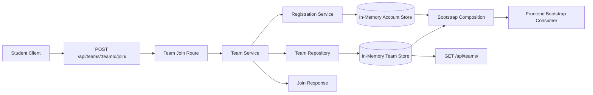

# Architecture for OCTOFIT-10

## Title
Existing Team Join Architecture

## Source
- Requirements document: artifacts/requirements.md
- Jira issue: OCTOFIT-10

## Architecture Summary
OCTOFIT-10 should extend the existing backend team slice with a join command path at `POST /api/teams/<team_id>/join/`. The route should delegate to the team service, which coordinates the existing team repository and registration/account service so one operation both assigns the student to a team and updates the team's member count. The resulting state must then flow through the existing read surfaces, especially `GET /api/teams/` and `GET /api/bootstrap/`, without introducing a parallel client contract.

## Assumptions
- The current Express backend remains the system boundary for the story.
- The join request targets an already-registered student account and identifies it with `accountId` in the JSON body.
- A student can belong to at most one team in the current in-memory model.
- No new frontend join control is required in this slice, but bootstrap data remains a client-consumed contract that must reflect joined state.
- In-memory persistence remains acceptable for this story.

## Recommended Architecture
Reuse the current layered backend and add one coordinated join command:
1. An API route at `POST /api/teams/:teamId/join/` owns HTTP concerns, parses the path parameter, and returns the JSON envelope.
2. The team service validates the join request, checks team existence, checks current membership, and coordinates the write across team and account state.
3. The team repository remains the single source of truth for persisted team aggregates and is responsible for incrementing the selected team's member count.
4. The registration service remains the single source of truth for persisted account data and is responsible for storing the student's team association.
5. The bootstrap payload and canonical team listing continue to reuse the existing read methods so the frontend sees the updated team state automatically.

## Key Components And Responsibilities
- Team Join API: Exposes `POST /api/teams/:teamId/join/`, validates request framing, and translates service results into HTTP responses.
- Team Service: Owns join business rules, including student identification, team existence checks, single-team membership enforcement, duplicate join prevention, and response shaping.
- Team Repository: Stores team records and applies the member-count increment for a successful join.
- Registration Service: Stores student accounts and applies the team association fields for a successful join.
- Bootstrap Service: Reuses the existing list APIs so downstream client data reflects the latest team and user state after joins.
- Frontend Consumer: Continues rendering teams from bootstrap data without requiring a contract fork; additive user team fields remain backward-compatible for the current client.

## Data Flow
1. A client sends `POST /api/teams/:teamId/join/` with a JSON body containing `accountId`.
2. The route handler delegates to the team service with the route parameter and request body.
3. The team service validates the team identifier and account identifier.
4. The team service reads the student account from the registration service and the target team from the team repository.
5. If the student is already on a team or the target team does not exist, the service returns a stable error response without mutating state.
6. For a valid first-time join, the registration service stores the student's `teamId` and `teamName`, and the team repository increments `memberCount` on the selected team.
7. The route returns a success envelope containing the updated student account and team snapshot.
8. Later calls to `GET /api/teams/` and `GET /api/bootstrap/` read the same in-memory sources and therefore reflect the join immediately.

## Technology Choices
- API framework: Existing Express application in the backend.
- Domain structure: Existing CommonJS modules with a coordinated service-layer write path.
- Team persistence boundary: Existing in-memory team repository, extended with a targeted member-count mutation.
- Account persistence boundary: Existing in-memory registration service, extended with team association fields and account lookup by id.
- Data contract: JSON response envelopes with top-level `status` and explicit `team` and `account` payloads on success.
- Frontend compatibility path: Existing static bootstrap renderer used as the reference consumer for team-related data changes.

## Risks And Tradeoffs
- The write spans two in-memory stores. That is acceptable in this process-local scaffold, but the mutation is not transactional across process boundaries and would need redesign for durable persistence.
- The current frontend does not expose a join workflow, so frontend impact is limited to compatibility of bootstrap data rather than an end-to-end UI interaction.
- Using `accountId` is the narrowest stable identifier already present in backend responses, but it couples the join request contract to existing account creation behavior.
- Team `memberCount` remains a numeric aggregate rather than a derived count from persisted member identities inside the team repository.

## Open Questions
1. Should a later story expose a dedicated frontend join experience rather than treating this as an API-only slice?
2. Should future persistence work unify account and team membership updates behind one durable storage boundary?